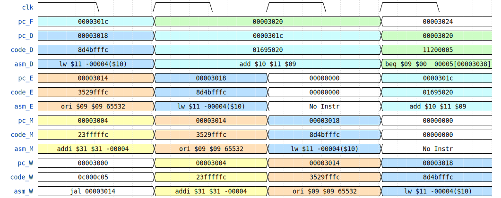

# DASM

一个用于实时反汇编 mips 指令的 Verilog module，目前支持课程中文指令集中全部的指令。其中，对于 `j`/`jal` 指令，会直接显示跳转的地址。

**注意：请不要在课程作业中提交本模块，否则有查重风险。推荐在本地的 testbench 而非 CPU 电路内实例化本模块，采用形如 `cpu.instr_D` 的方式接入 CPU 模块内部的信号，并且在提交时只提交 CPU 电路。**

## 使用方法

将 `DASM.v` 文件放置在 cpu 目录下，在需要的 module 里面将其实例化。其中：
- `instr` 为 32 bit 指令
- `reg_name` 为 0 时表示显示寄存器编号，为 1 时表示显示寄存器名字（0 号寄存器统一用 `$00` 表示）
- `asm` 是一个字符串，表示反汇编结果，可以不连。
- `pc` 表示当前的 pc，用来显示 `branch` 类指令的地址
- `imm_as_dec` 表示是否将立即数用十进制显示（默认HEX，用十进制时 `addi`/`addiu`/`slti`/`sltiu` 会进行符号扩展，其余进行无符号扩展）

个人推荐 `reg_name` 设置为 `0`，一方面这样好在 GRF 里面找到对应的寄存器，另一方面这和 Mars 的处理结果一致。

```verilog
DASM Dasm(
    .pc(pc),
    .instr(instr),
    .imm_as_dec(1'b1),
    .reg_name(1'b0),
    .asm()
);
```

## 效果示例

在五级流水线 CPU 的 D, E, M, W 四个流水级分别实例化一个 `DASM` 模块，反汇编每个流水级上的指令，波形展示效果如下（反汇编结果的 `asm` 信号以 ASCII 模式显示）。

立即数以十六进制显示：


立即数以十进制显示：

